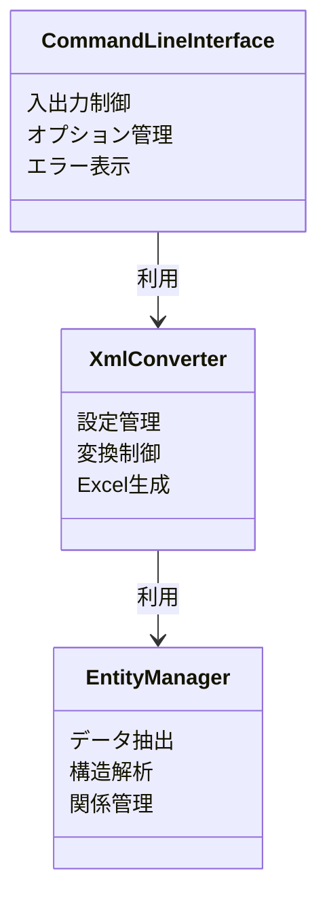
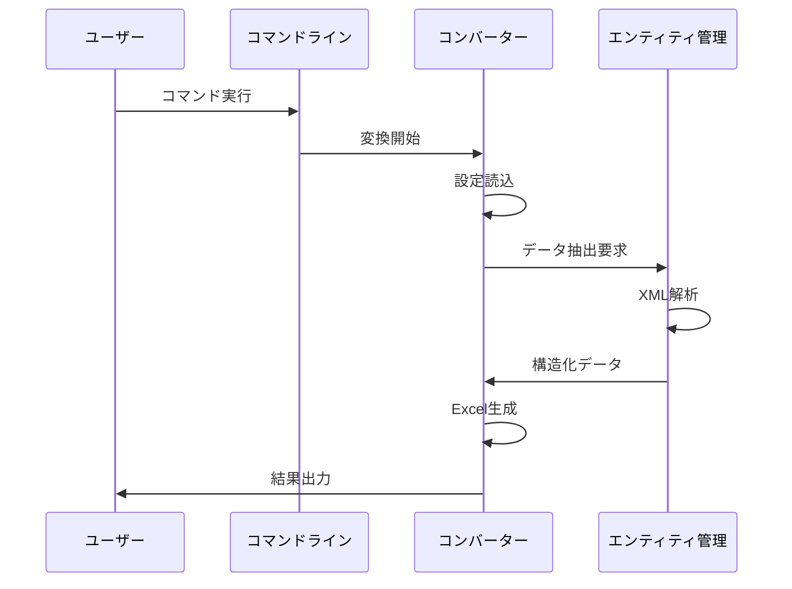

# xml2xlsx 基本設計書

## 1. はじめに

本書は、XMLデータをExcelファイルに変換するコンバーターシステムの基本設計を記述したものである。本システムは、企業内で扱われる様々な形式のXMLデータを、業務で利用しやすいExcel形式に変換することを目的としている。

## 2. システム要件

### 2.1 基本要件

本システムは、以下の基本要件を満たすものとする。

1. XMLファイルをExcelファイルに変換する機能を提供すること
2. 設定ファイルによって柔軟なデータマッピングを可能とすること
3. コマンドラインから操作可能であること
4. 大規模なXMLファイルも処理可能であること

### 2.2 機能要件

#### 2.2.1 入力機能
1. XMLファイルからの入力
2. 標準入力からのXMLデータ受け取り
3. TOML形式の設定ファイル読み込み

#### 2.2.2 変換機能
1. XML要素からのエンティティ抽出
2. 親子関係の解決とデータの構造化
3. カラム名のマッピングと変換
4. データ型の標準化

#### 2.2.3 出力機能
1. Excelファイルの生成
2. バイナリデータとしての出力
3. 複数シートの生成

## 3. システム構成

### 3.1 全体構成

本システムは、以下の主要コンポーネントから構成される。

1. コマンドラインインターフェース
   - ユーザーとの対話
   - 入出力の制御
   - オプションの処理

2. XMLコンバーター
   - 設定の管理
   - 変換処理の制御
   - エラー処理

3. エンティティ管理
   - データの抽出
   - 構造の解析
   - 関係性の管理

### 3.2 コンポーネント間の関係

## 4. 処理フロー

### 4.1 基本フロー

## 5. データ構造

### 5.1 設定ファイル構造

設定ファイルは以下の情報を含む。

1. エンティティ定義
   - シート名の指定
   - プライマリーキーの設定
   - カラムマッピング

2. マッピングルール
   - 要素名と列名の対応
   - データ型の指定
   - 変換規則

### 5.2 内部データ構造

データは以下の構造で管理される。

1. エンティティデータ
   - 要素データ
   - 属性データ
   - 親子関係情報

2. 変換データ
   - シート単位のデータ
   - カラム情報
   - データ型情報

## 6. 非機能要件

### 6.1 性能要件

1. 処理速度
   - 1MB以下のXMLファイル：1秒以内
   - 10MB以下のXMLファイル：10秒以内
   - 100MB以下のXMLファイル：120秒以内

2. メモリ使用量
   - 入力ファイルサイズの5倍以内

### 6.2 信頼性要件

1. エラー処理
   - 不正な入力の検出
   - エラーメッセージの提供
   - 異常終了時のリソース解放

2. データ整合性
   - 参照整合性の確保
   - データの完全性検証

### 6.3 運用要件

1. 保守性
   - ソースコードの文書化
   - テストコードの整備
   - モジュール化の推進

2. 拡張性
   - 新規フォーマット対応
   - カスタマイズ機能
   - プラグイン機構

## 7. セキュリティ要件

1. データ保護
   - 一時ファイルの適切な削除
   - メモリ上のデータクリア

2. アクセス制御
   - ファイルパーミッションの考慮
   - 実行権限の管理

詳細な実装仕様については、[詳細設計書](detailed-design.md)を参照すること。