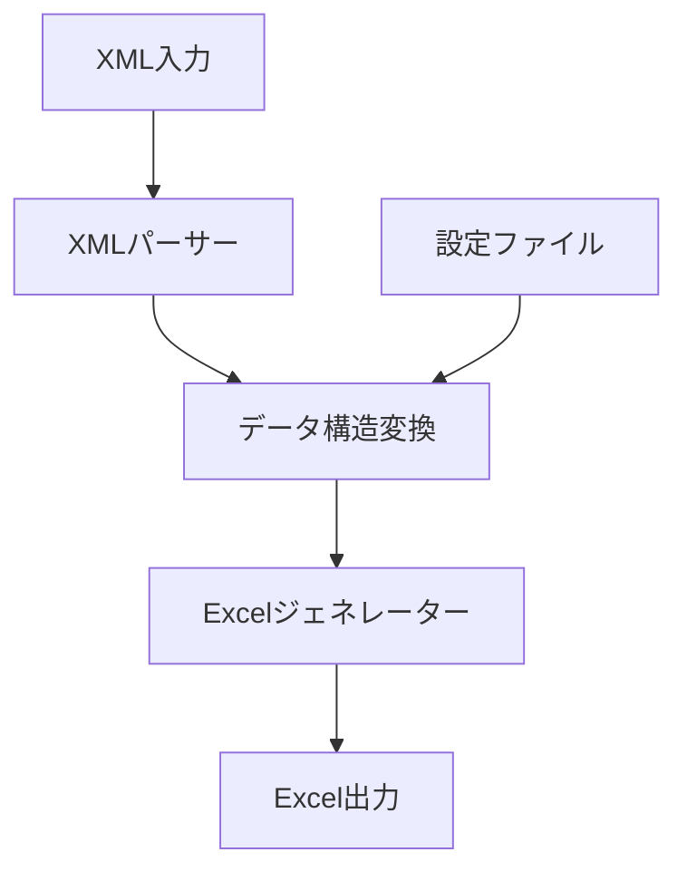

# プロジェクト技術仕様書

## 1. システム概要

### 1.1 目的
- XMLデータを構造化されたExcelファイルに変換するツール
- 大規模データセット、複雑なXML構造、特殊なXML要素（CDATA等）に対応

### 1.2 技術スタック
- 言語: Python
- 主要ライブラリ:
  - pandas: データフレーム処理とExcel出力
  - openpyxl: Excel生成（.xlsx形式の操作に最適）
  - toml: TOML設定ファイル解析
  - click: CLIインターフェース構築
  - xml.etree.ElementTree: XMLパース（標準ライブラリ）

## 2. アーキテクチャ概要図


core_system
  ├── cli.py [コマンドライン引数処理]
  ├── converter.py [変換ロジックのコア]
  ├── entity.py [データモデル定義]
  └── __main__.py [エントリーポイント]

## 3. 核となる仕様定義

### 3.1 データ構造
```python
class Config:
    mapping: Dict[str, EntityConfig]  # エンティティごとの設定

class EntityConfig:
    sheet_name: str            # 出力先シート名
    columns: Dict[str, str]    # ソースフィールド→出力カラム名のマッピング
    primary_keys: List[str]    # エンティティを一意に識別するキー

class Entity:
    type: str                 # エンティティタイプ
    data: Dict[str, str]      # 抽出されたデータ
    
class EntityContext:
    entities: Dict[str, List[Entity]]  # タイプごとのエンティティリスト
```

### 3.2 主要インターフェース
```python
class XmlToExcelConverter:
    def convert(xml_input: str | Path | bytes, output_path: str | Path | None = None) -> bytes | None
    def _create_dataframe(data_list: List[Dict[str, str]], entity_type: str) -> pd.DataFrame
    def _get_column_mapping(entity_type: str, data_columns: List[str]) -> Dict[str, str]
```

## 4. 制約条件

### 4.1 技術的制約
- 入力形式: ファイルパス、XML文字列、バイナリデータに対応
- 出力制限: Excelの行数制限（1,048,576行）に準拠
- データ型: すべての値は文字列として処理

### 4.2 ビジネス制約
- データ整合性: プライマリーキーによるエンティティの一意性保証
- エラー処理: 詳細なログ出力による問題箇所の特定
- 設定の柔軟性: 設定ファイルなしでの自動マッピング対応

## 5. 重要な実装方針

### 5.1 エラーハンドリング
- XML解析エラー → 入力形式に応じた適切なパース処理
- 設定ファイルエラー → 必須項目（primary_keys）の検証
- データ変換エラー → 警告ログと処理継続の両立

### 5.2 パフォーマンス最適化
- データ変換: pandasによる効率的なデータフレーム処理
- メモリ管理: 必要なカラムのみを抽出して処理
- エラー回復: エンティティ単位での独立した処理継続

## 6. テスト要件

### 6.1 重要なテストシナリオ
1. 基本的な変換テスト
   - 入力: シンプルなXML構造
   - 期待: 正確なExcelカラムマッピング

2. CDATA対応テスト
   - 入力: CDATA要素を含むXML
   - 期待: テキストが正しく抽出される

3. 大規模データテスト
   - 入力: 100万行以上のXMLデータ
   - 期待: メモリエラーなく処理完了

4. 複合キーテスト
   - 入力: 複数要素を組み合わせたマッピング
   - 期待: 正確なデータ結合